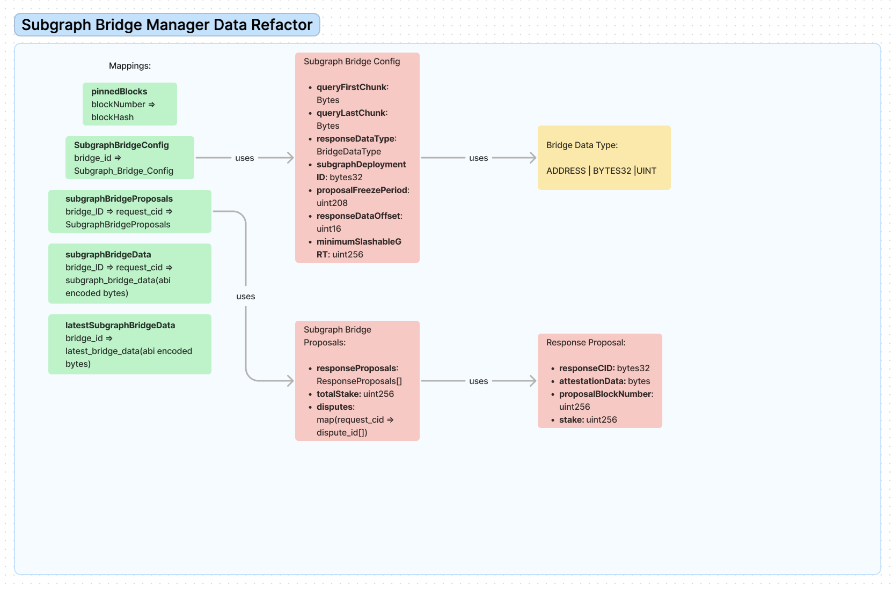
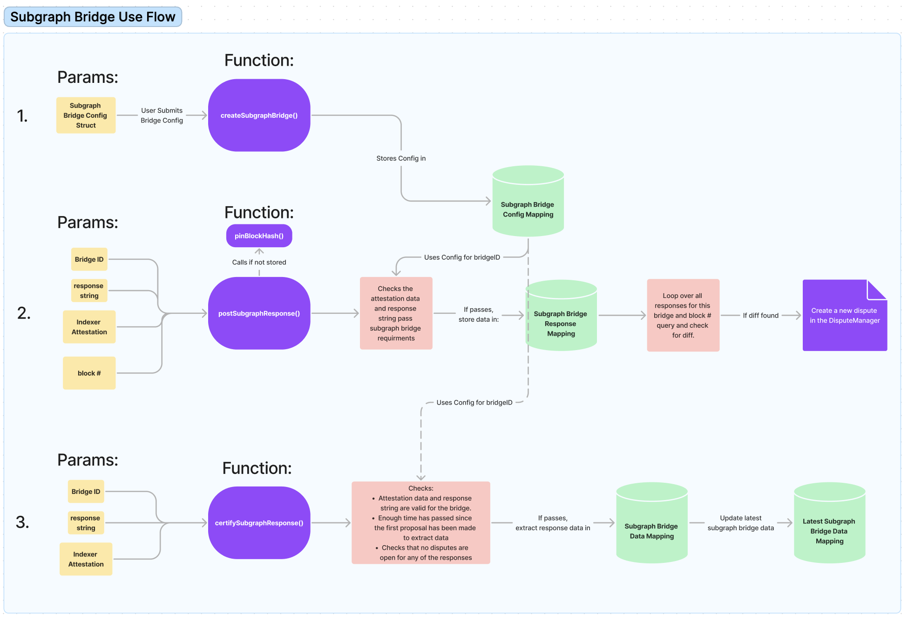

## Useful Diagrams

Visual Diagram of data structure


Visual Diagram of using the Bridge


## How to use the SubgraphBridge

The SubgraphBridgeManager contract allows a user to create a Subgraph Bridge. This allows for the bridging of a subgraph query result back on chain in a configurably optimistic manner.

Because there are different levels of security needed for different protocols, users should be able to configure how much security their bridge needs. The main configuration variables for a bridge are:

- `queryFirstChunk`: The hex representation of the query from the start -> where the blockhash is in the query string.
- `queryLastChunk`: The hex representation of the query from the blockhash end -> the end of the query string.
- `responseDataType`: What kind of response data should be extracted from the subgraph query result.
- `proposalFreezePeriod`(optional): The amount of blocks after which an undisputed query proposal can be used. Set to 0 for instant query proposal use.
- `responseDataOffset`: The byte offset in which the response data to use is located in the response string.
- `minimumSlashableGRT`: The minimum amount of GRT eligible for slashing for a proposal to pass. This is to allow configurable security and trust in the results of a subgraph query. Higher Value == more trust the data is correct.

```solidity
SubgraphBridgeManager subgraphBridgeManager = 0xasdfasdf....;

struct SubgraphBridgeConfig {
	// QUERY AND RESPONSE CONFIG
	bytes queryFirstChunk;
	bytes queryLastChunk;
	BridgeDataType responseDataType;
	bytes32 subgraphDeploymentID;

	// DISPUTE HANLDING CONFIG
	uint208 proposalFreezePeriod;
	uint16 responseDataOffset;
	uint8 minimumSlashableGRT;
}

// creating a bridge
SubgraphBridge sampleBridge = SubgraphBridge(
	firstChunk,
	lastChunk,
	bridgeDataType,
	subgraphDeploymentId,
	proposalFreezePeriod,
	responseDataOffset,
	minimumSlashableGRT,
);
```

Once you have a Subgraph Bridge configured, call the `createSubgraphBridge` function in, passing in your new Subgraph Bridge as a param.

```solidity
subgraphBridgeManager.createSubgraphBridge(sampleBridge);
// returns the subgraph bridge id (keccak256 hash of the packed abi encoded subgraph bridge config data)
```

To bridge a query result to your subgraphBridge, call the `postSubgraphResponse` function, passing in the query blockhash, the subgraphBridgeID, the query response, and the attestation data. This will start the period for a subgraph bridge result to be disputed if you configured your bridge to do so.

```solidity
subgraphBridgeManager.postSubgraphResponse(
	blockNumber, // the block number you are posting data from (must be pinned if older than 256 blocks otherwise it will fail, this is a solidity restriction of only storing the most recent 256 block hashes)
	bridgeId,
	responseData, // response data JSON string
	attestationBytes // extracted indexer-attestation data packed and parsed as bytes
);
```

After the dispute window has closed and nobody has submitted a conflicting attestation, you can now certify and use your subgraph response data. Do this by calling the `certifySubgraphResponse` function, passing in the subgraphBridgeID, the query response, and the attestation data as bytes.

```solidity
subgraphBridgeManager.postSubgraphResponse(
	bridgeId,
	response,
	attestationBytes
);
```

Finally you are able to use the extracted subgraph bridge data on chain. Call the getter function `subgraphBridgeData(bytes32 subgraphBridgeID, bytes32 requestCID)` passing in the subgraphBridgeID and the requestCID. The data will be stored as abi encoded bytes. So to use the data you must abi decode the data as your requested type.

```solidity
bytes memory responseData = bridge.subgraphBridgeData(bridgeId, requestCID1);

address responseAsAddress = abi.decode(responseData, (address));
```

### Implimentation Notes and Gotchas

Here are some important details to reference.

- We must make sure that we convert the blockHash in the query to `bytes memory hex'asdfo'` before we use it. As if we don't we aren't hashing the correct data.

- It is easier to work with the query strings stored as bytes so we don't have to worry about weird escaping and stuff like that. Also helps us sanity check when it comes time to compare values for testing. So I think that when it comes time to build a product we need to keep this in mind.

- When it comes time to escape the query string, _IT IS EXTREMELY IMPORTANT THAT EACH LEVEL OF INDENTATION HAS ONLY 2 SPACES OF SHIFT. IF YOU HIT TAB IT IS 4 SPACES, THIS MESSES UP THE HASH!!!!!!_

- Query Strings follow this pattern, where `<QUERY>` is the actual playground query, string escaped on a single line: Note the extra newline at the end of the query. This can be removed if `<QUERY>` contains this naturally.
  `{"query":"<QUERY>\n","variables":{}}`

- The Attestation Data for `_parseAttestation()` should be packed hex data. Either as a hex literal like: `hex"requestCIDresponseCIDsubgraphDeploymentID,r,s,v"` or using `abi.encodePacked`

---

#### First Sample (HOP MAINNET):

_Note how all of the query options for blocks are on one line_

Literal Graphql Query:

```graphql
{
  bonderAddeds(first: 10, block: { hash: "0xeee517bc8c2cdaf7b1a122161223fd9d29d25f9250b071c964d508c5a9cb0ee3" }) {
    id
  }
}
```

Escaped Query:

```raw_string
{\n  bonderAddeds(first: 10, block: {hash: \"0xeee517bc8c2cdaf7b1a122161223fd9d29d25f9250b071c964d508c5a9cb0ee3\"}) {\n    id\n  }\n}
```

QueryString:

```
{"query":"{\n  bonderAddeds(first: 10, block: {hash: \"0xeee517bc8c2cdaf7b1a122161223fd9d29d25f9250b071c964d508c5a9cb0ee3\"}) {\n    id\n  }\n}\n","variables":{}}

```

Query Template:

```
{"query":"{\n  bonderAddeds(first: 10, block: {hash: \"\"}) {\n    id\n  }\n}\n","variables":{}}

```

First Chunk:

```
{"query":"{\n  bonderAddeds(first: 10, block: {hash: \"

```

First Chunk Hex:

```
7b227175657279223a227b5c6e2020626f6e6465724164646564732866697273743a2031302c20626c6f636b3a207b686173683a205c22
```

Block Hash String:

```
0xeee517bc8c2cdaf7b1a122161223fd9d29d25f9250b071c964d508c5a9cb0ee3

```

Block Hash Hex:

```
307865656535313762633863326364616637623161313232313631323233666439643239643235663932353062303731633936346435303863356139636230656533

```

Last Chunk String:

```
\"}) {\n    id\n  }\n}\n","variables":{}}

```

Last Chunk Hex:

```
5c227d29207b5c6e2020202069645c6e20207d5c6e7d5c6e222c227661726961626c6573223a7b7d7d

```

Total Query Hex:

```
7b227175657279223a227b5c6e2020626f6e6465724164646564732866697273743a2031302c20626c6f636b3a207b686173683a205c223078656565353137626338633263646166376231613132323136313232336664396432396432356639323530623037316339363464353038633561396362306565335c227d29207b5c6e2020202069645c6e20207d5c6e7d5c6e222c227661726961626c6573223a7b7d7d
```

Total Query Hex Hash (Should be requestCID):

```
0x200d785a4e650a6d55daec459392da7c1e22a3304710221a0b807e2260626aca
```

RequestCID:

```
0x200d785a4e650a6d55daec459392da7c1e22a3304710221a0b807e2260626aca
```

---

### Test Same Query with a new blockhash:

First Chunk Hex:

```
7b227175657279223a227b5c6e2020626f6e6465724164646564732866697273743a2031302c20626c6f636b3a207b686173683a205c22
```

Last Chunk Hex:

```
5c227d29207b5c6e2020202069645c6e20207d5c6e7d5c6e222c227661726961626c6573223a7b7d7d
```

BlockHash String:

```
0x5b1dc013f92873fe9017f28612ef67a5b141e83f75f036d9cb7c8e1b8ef805be
```

BlockHash Hex:

```
307835623164633031336639323837336665393031376632383631326566363761356231343165383366373566303336643963623763386531623865663830356265
```

Total Query Hex:

```
7b227175657279223a227b5c6e2020626f6e6465724164646564732866697273743a2031302c20626c6f636b3a207b686173683a205c223078356231646330313366393238373366653930313766323836313265663637613562313431653833663735663033366439636237633865316238656638303562655c227d29207b5c6e2020202069645c6e20207d5c6e7d5c6e222c227661726961626c6573223a7b7d7d
```

Total Query Hash (Should be Request CID):

```
0x294d2e09b8935ecec4294e6e3cf8f0f047877f6d5ec6f7ccaf53ba48ce8e1f74
```

ACTUAL REQUEST CID:

```
0x294d2e09b8935ecec4294e6e3cf8f0f047877f6d5ec6f7ccaf53ba48ce8e1f74
```
